## Screenshots

Many completed projects have used z88dk, most projects have been games, including Timmy's flip-screen shoot-em ups [Future Looter](https://spectrumcomputing.co.uk/entry/27279/ZX-Spectrum/Future_Looter) running on the +zx:

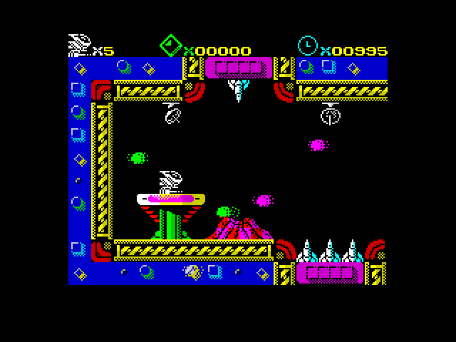

as well as Timmy's [Heart Stealer](https://spectrumcomputing.co.uk/entry/24829/ZX-Spectrum/Heart_Stealer) platform game running on +zx:

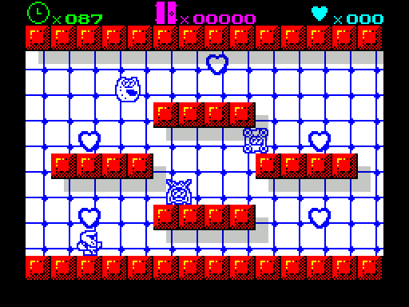

and Timmy's graphical adventure game [Magical Tower Adventure](https://www.msxgamesworld.com/software-gallery.php?id=5177) running on +msx:

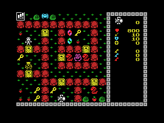

not forgetting Stefan Bylund's brilliant port of [Magnetic](https://gitlab.com/strandgames/brahman/-/tree/master/zxnext_magnetic) which actually emulates an m68k to interpret Magnetic Scrolls text adventures:

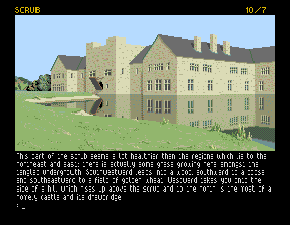

With z88dk it's easy to create massively portable software - DStar is one of the example programs within z88dk and although it does run on most of our targets from the exact same source file, sadly we stopped collecting screenshots of it a few years ago so we've not got them all. 

<table>
<tr><td>Timex TS2068</td><td>ABC80</td><td>Mattel Aquarius</td><td>MSX</td></tr>
<tr>
<tr>
<td>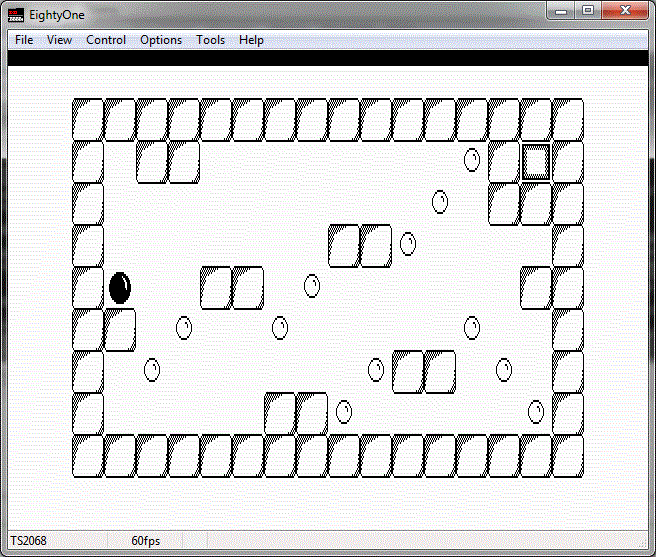</td>
<td>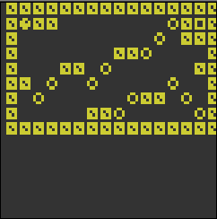</td>
<td>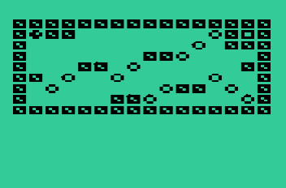</td>
<td>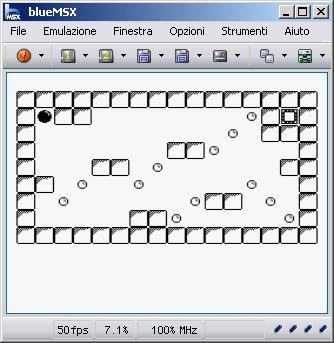</td>
</tr>
<tr><td>Sharp OZ</td><td>ZX Spectrum</td><td>Sorcerer</td><td>TI82</td></tr>
<tr>
<td>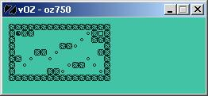</td>
<td>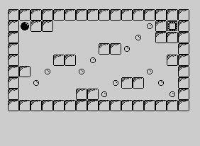</td>
<td>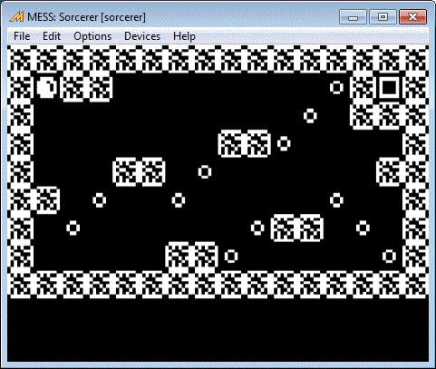</td>
<td>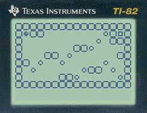</td>
</tr>
</table>